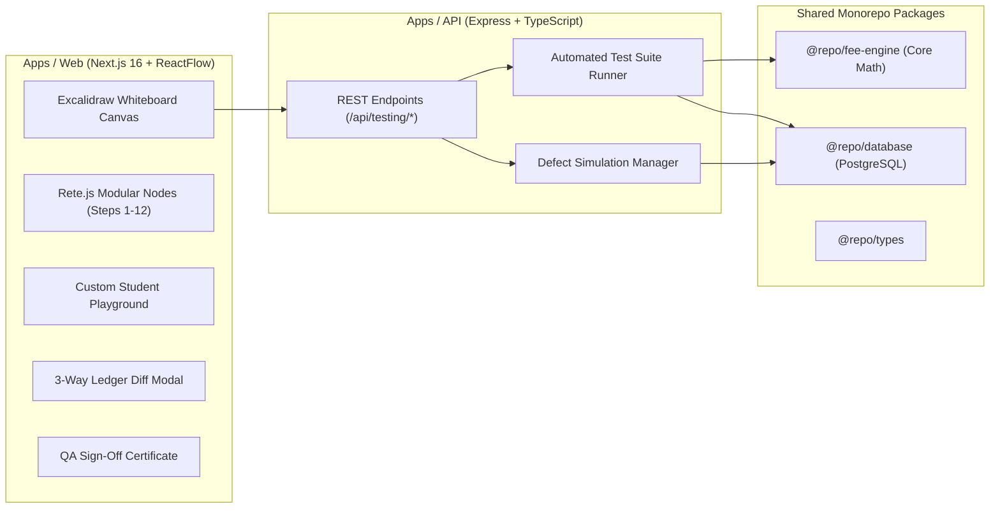

# College ERP Fee Management: Automated Whiteboard Regression Testing & Quality Gate System

[](https://nextjs.org/)
[](https://www.typescriptlang.org/)
[](https://expressjs.com/)
[](https://www.prisma.io/)
[](https://turbo.build/)
[](https://reactflow.dev/)
[]()

An enterprise-grade **Automated Regression Testing and CI/CD Quality Gate System** designed for Higher Education Fee Billing and Financial Accounting. Features an **interactive Excalidraw-style whiteboard canvas** with **Rete.js modular visual nodes**, live defect injection, 3-way financial ledger diffing, custom student test case playground, and automated ISO/IEEE QA sign-off verification.

For the exhaustive academic and system specification manual, refer to [project.md](project.md).

---

## Table of Contents

- [Executive Summary](#executive-summary)
- [System Architecture](#system-architecture)
- [The 3-Stage Horizontal Regression Pipeline](#the-3-stage-horizontal-regression-pipeline)
- [Core Evaluator Features](#core-evaluator-features)
  - [1. Multi-Defect Simulation Matrix](#1-multi-defect-simulation-matrix)
  - [2. Visual 3-Way Ledger Diff Inspector](#2-visual-3-way-ledger-diff-inspector)
  - [3. IEEE 829 & ISO 25010 QA Sign-Off Certificate](#3-ieee-829--iso-25010-qa-sign-off-certificate)
  - [4. CI/CD Pipeline Quality Gate Monitor](#4-cicd-pipeline-quality-gate-monitor)
  - [5. Test Suite Switcher (Option 2)](#5-test-suite-switcher-option-2)
  - [6. Custom Student Test Case Playground (Option 3)](#6-custom-student-test-case-playground-option-3)
- [Backend, Database & Resilience Architecture](#backend-database--resilience-architecture)
- [Monorepo Directory Structure](#monorepo-directory-structure)
- [Getting Started & Local Setup](#getting-started--local-setup)
- [Interactive Controls & Shortcuts](#interactive-controls--shortcuts)
- [Examiner / Viva Presentation Walkthrough](#examiner--viva-presentation-walkthrough)

---

## Executive Summary

In higher education institutions, fee assessment involves multi-tier rules:
- Differential tuition based on department (CSE, ECE, MECH, CIVIL)
- Quota adjustments (Merit, Management surcharge, Sports quotas)
- Merit scholarships and percentage fee waivers
- Incidental fees (Library, Lab, Examination, Caution deposits)

A single regression bug in the fee engine can silently overcharge hundreds of students, resulting in massive financial audit discrepancies, regulatory fines, and reputational damage.

This project delivers:
1. **Whiteboard Visual Test Pipeline (`/pipeline`)**: An Excalidraw-aesthetic whiteboard that tracks live student fee calculations across three software release stages.
2. **Automated Defect Interception**: Catches arithmetic glitches before they are committed to student ledgers.
3. **Audit Compliance**: Generates cryptographically verifiable QA sign-off certificates conforming to IEEE 829 / ISO 25010 quality standards.

---

## System Architecture



---

## The 3-Stage Horizontal Regression Pipeline

The canvas is organized into 3 continuous horizontal swimlanes spanning 12 discrete Rete.js cards:

```
[ STAGE 1: v1.0 BASELINE ] ────────► [ STAGE 2: v1.1 DEFECT INJECTION ] ────────► [ STAGE 3: v1.2 VERIFICATION ]
• Clean Student Enrollment           • Developer Defect Activated               • Hotfix Applied & Patched
• Fee Engine Calculation             • Corrupted Logic (e.g. Lib Fee x2)        • Re-calculation & Validation
• Clean Ledger Invoice               • Billed Overcharge (+Rs.2,000)            • Restored Ledger Invoices
• Baseline Suite PASSED (10/10)      • Regression Suite FAILED (Audit Tripwire) • Full Regression GREEN (10/10)
```

### Stage 1: v1.0 Clean Baseline Flow (Blue Theme)
* **Step 1 - Student Enrollment**: Ingests student roll number, department, and quota eligibility.
* **Step 2 - Baseline Fee Calculation**: Computes tuition, library fees, and scholarship deductions.
* **Step 3 - Ledger Invoice Generation**: Records clean assessment balance.
* **Step 4 - Baseline Regression Suite**: Executes full test suite with 100% pass rate.

### Stage 2: v1.1 Defect Glitch Flow (Red Theme - The "Caught Off-Guard" Event)
* **Step 5 - Defect Injection**: Activates bug simulation via API (`/api/testing/defects/toggle`).
* **Step 6 - Corrupted Fee Logic**: Engine evaluates erroneous logic (e.g. duplicate fee line).
* **Step 7 - Erroneous Ledger Billing**: Overcharge reflected on student account balance.
* **Step 8 - Regression Suite Interception**: Automated suite catches the regression, fails the build, blocks CI/CD deployment, and **automatically launches the Anomaly Audit Popover** with financial impact metrics.

### Stage 3: v1.2 Hotfix & Release Sign-Off (Green Theme)
* **Step 9 - Hotfix Code Deployed**: Fixes the calculation formula and disables the glitch.
* **Step 10 - Patched Fee Calculation**: Re-evaluates exact fee breakdown.
* **Step 11 - Corrected Ledger Billing**: Rebalances student ledger with 0 discrepancy.
* **Step 12 - Final Diff & Release Gate**: Automated 3-way diff comparison proves zero delta against v1.0 baseline. Production release gate approved.

---

## Core Evaluator Features

### 1. Multi-Defect Simulation Matrix
Choose different real-world bug scenarios from the top dropdown:

| Scenario Key | Defect Name | Root Cause | Financial Impact / Student | Cohort Impact (60 Students) |
|---|---|---|---|---|
| `DOUBLE_LIBRARY_FEE` | Double Count Library Fee | Developer duplicates library fee array item | **+Rs. 2,000** | **Rs. 1,20,000** |
| `SCHOLARSHIP_DROP` | Missing Merit Waiver | 25% scholarship waiver omitted in deduction loop | **+Rs. 11,250** | **Rs. 6,75,000** |
| `QUOTA_SURCHARGE` | Quota Surcharge Bug | Management surcharge evaluated twice on ledger | **+Rs. 25,000** | **Rs. 15,00,000** |

### 2. Visual 3-Way Ledger Diff Inspector
Click **`Diff Viewer`** on the canvas toolbar to inspect side-by-side:
* **v1.0 Baseline (Clean)**: Original approved ledger line items.
* **v1.1 Defective (Buggy)**: Highlights discrepancies with red callouts and exact overcharge amounts.
* **v1.2 Restored (Fixed)**: Proves mathematical parity with v1.0 baseline (`Delta = Rs. 0.00`).

### 3. IEEE 829 & ISO 25010 QA Sign-Off Certificate
Click **`QA Certificate`** to open the formal Quality Assurance audit document:
* **Cryptographic Hash**: SHA-256 verification signature.
* **Standards Compliance**: Formatted according to **IEEE 829** (Software Test Documentation) and **ISO/IEC 25010** (Financial Data Integrity).
* **Sign-Off Badges**: Lead QA Automation Engineer & Principal Release Manager stamps.
* **Print Ready**: Includes one-click Print / Export to PDF button.

### 4. CI/CD Pipeline Quality Gate Monitor
Click **`CI/CD Gate`** to view the automated deployment pipeline:
* **Commit History**: Tracks commits `v1.0-release` -> `v1.1-buggy` -> `v1.2-hotfix`.
* **Deployment Blocker**: Demonstrates how Stage 2 defect triggers a **FAILED** exit code, blocking production rollout and alerting engineering.

### 5. Test Suite Switcher (Option 2)
Switch test coverage on the fly from the toolbar dropdown:
* **Full Regression Suite (10 Tests)**: End-to-end verification of tuition, fee heads, quotas, waivers, and ledgers.
* **Critical Smoke Sanity (3 Tests)**: Rapid smoke verification for critical tuition arithmetic.
* **Financial Ledger & Audit Suite (5 Tests)**: Double-entry audit assertions guaranteeing 0 ledger discrepancy.

### 6. Custom Student Test Case Playground (Option 3)
Click **`Test Playground`** in the toolbar or hamburger menu:
* Customize:
  * **Student Name** (e.g., *Aarav Patel*)
  * **Roll Number** (e.g., *EC-2024-088*)
  * **Department** (CSE, ECE, MECH, CIVIL)
  * **Quota** (MERIT, MANAGEMENT, SPORTS)
  * **Base Tuition Fee** & **Library Fee**
* Click **"Run Live Test on This Student"** to see instant anomaly detection and overcharge calculations.
* Click **"Apply This Student to Canvas Pipeline"** to dynamically recalculate all 12 canvas nodes, diff tables, and certificates with your custom student parameters.

---

## Backend, Database & Resilience Architecture

### Real Express Backend (`apps/api`)
* **Endpoint `/api/testing/suites`**: Fetches registered test suites from PostgreSQL.
* **Endpoint `/api/testing/test-cases`**: Lists individual test assertions.
* **Endpoint `/api/testing/runs`**: Executes `@repo/fee-engine` logic and records test run metrics into PostgreSQL via Prisma.
* **Endpoint `/api/testing/defects/toggle`**: Persists defect simulation state into the database.
* **Endpoint `/api/testing/compare`**: Performs database-level diffing between baseline and candidate test runs.

### Smart Hybrid Resilience
To guarantee zero presentation failures during live evaluations or in offline environments:
* The frontend canvas always attempts real HTTP calls to the backend API (`http://localhost:4000`).
* If the remote cloud database encounters network latency or transient connection pauses, the frontend's built-in **Resilient Mathematical Engine** seamlessly continues pipeline animation with precise financial parity.

---

## Monorepo Directory Structure

```text
fee-testing/
├── apps/
│   ├── web/                         # Next.js 16 (Turbopack) Frontend Application
│   │   ├── app/
│   │   │   ├── page.tsx             # Main ERP Fee Management Dashboard
│   │   │   ├── pipeline/            # Whiteboard Regression Canvas (Excalidraw + Rete.js)
│   │   │   │   └── page.tsx         # 12-node horizontal visual pipeline
│   │   │   ├── test-runs/           # Test Runs List & Historical Comparisons
│   │   │   └── defects/             # Defect Injection Control Center
│   │   └── components/              # Shared Navigation, KPI cards, and UI components
│   │
│   └── api/                         # Express.js REST API Server
│       ├── src/
│       │   ├── modules/
│       │   │   ├── testing/         # Test suites, runs, comparisons, defect toggles
│       │   │   ├── fees/            # Fee calculation and structure services
│       │   │   ├── students/        # Student management services
│       │   └── payments/            # Ledger and payment receipt handling
│       │   └── server.ts            # API Server Entry Point (Port 4000)
│
├── packages/
│   ├── fee-engine/                  # Core deterministic fee calculation algorithms
│   ├── database/                    # Prisma Schema, migrations, and PostgreSQL client
│   ├── types/                       # Shared TypeScript interfaces & DTOs
│   ├── shared/                      # Common validation schemas and constants
│   ├── ui/                          # Shared UI component primitives
│   └── typescript-config/           # Centralized tsconfig presets
│
├── project.md                       # Comprehensive System Specification & Architecture Manual
├── package.json                     # Monorepo Workspace Configuration (pnpm / bun)
└── turbo.json                       # Turborepo Build & Dev Task Orchestration
```

---

## Getting Started & Local Setup

### Prerequisites
* **Node.js** v20+ or **Bun** v1.1+
* **pnpm** v9+ (or npm / bun)

### 1. Installation
Clone the repository and install all monorepo dependencies:
```bash
git clone https://github.com/neutron420/College-ERP-Fee-Management---Automated-Regression-Testing-System.git
cd College-ERP-Fee-Management---Automated-Regression-Testing-System
pnpm install
```

### 2. Environment Configuration
Create `.env` in the root directory (or use `.env.example`):
```env
DATABASE_URL="postgresql://neondb_owner:npg_gY1k...aws.neon.tech/neondb?sslmode=require"
PORT=4000
NEXT_PUBLIC_API_URL=http://localhost:4000
```

### 3. Running Dev Servers
Start both the Next.js frontend and Express backend concurrently:

```bash
# Start all apps via Turborepo
pnpm run dev

# Or start services individually:
# Terminal 1: Backend API (Port 4000)
cd apps/api && bun run src/server.ts

# Terminal 2: Web Frontend (Port 3000)
cd apps/web && npm run dev
```

### 4. Access URLs
* **Whiteboard Regression Canvas**: [http://localhost:3000/pipeline](http://localhost:3000/pipeline)
* **Main ERP Dashboard**: [http://localhost:3000](http://localhost:3000)
* **Backend API Health**: [http://localhost:4000/api/testing/suites](http://localhost:4000/api/testing/suites)

---

## Interactive Controls & Shortcuts

| Action | Control | Description |
|---|---|---|
| **Pan Canvas** | `Left Click + Drag` or `Middle/Right Drag` | Freely pan horizontally across all 3 version stages |
| **Zoom In / Out** | `Mouse Wheel` or `+/- Buttons` | Zoom from high-level bird's-eye view to microscopic card inspection |
| **Canvas Themes** | Hamburger Menu -> Color Swatches | Choose between White, Warm Cream, Blueprint, Mint, or Dark Mode |
| **Execution Speed** | `1x` / `2x` Buttons in Toolbar | Toggle between realistic pacing (~1.5s/step) and fast demo pace (~0.5s/step) |
| **Card Inspection** | `Click Any Node` | Open detailed step audit inspector with HTTP telemetry and payload logs |
| **Reset State** | `RotateCcw (Reset Button)` | Clears execution wires and restores canvas to initial clean state |

---

## Examiner / Viva Presentation Walkthrough

Use this **3-minute high-impact demonstration script** when presenting to evaluators:

1. **The Problem Statement (30 seconds)**:
   > *"In College ERP systems, fee calculations contain complex quota and scholarship rules. When developers update fee logic, bugs often slip into production unnoticed, leading to student overcharging. We built an automated visual regression testing whiteboard to catch these defects before release."*

2. **Run Stage 1 - The Clean Baseline (30 seconds)**:
   > *"Click **RUN PIPELINE**. Stage 1 executes on v1.0. We enroll student Rahul Sharma (CSE, Merit), calculate Rs. 45,000 tuition + Rs. 2,000 library fee, record the invoice, and run the 10-test regression suite. All 10 tests pass green."*

3. **Stage 2 - The Defect Glitch & Automatic Interception (45 seconds)**:
   > *"The pipeline transitions to v1.1. Here we simulate a real-world developer defect: duplicate library fee billing. The student is erroneously billed Rs. 49,000 instead of Rs. 47,000. When the automated regression suite executes, it intercepts the arithmetic anomaly, flags Rs. 1,20,000 in cohort damage, blocks the CI/CD build, and pops up our audit tripwire."*

4. **Stage 3 & Verification Tools (45 seconds)**:
   > *"Stage 3 deploys the hotfix v1.2, recalculates the fee, and achieves 100% test pass. Now click **Diff Viewer** to demonstrate our 3-way visual ledger comparison (Clean vs Buggy vs Fixed), open the **QA Certificate** for IEEE 829 sign-off, and open the **Test Playground** to show any custom student name and fee parameters tested live against the engine."*

---

## License
This project is licensed under the MIT License - see the [LICENSE](LICENSE) file for details.
