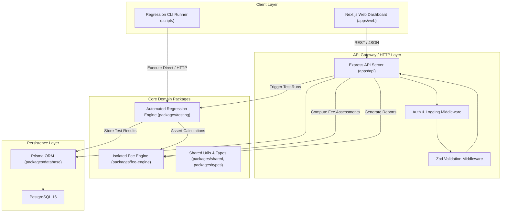

# 07 - System Architecture

## 1. High-Level Architecture Overview
The system follows a modern Monorepo architecture managed with Turborepo and Bun. It adopts a **Modular Monolith** pattern for the backend, an isolated pure domain package for mathematical computation, and a responsive web application frontend.

## 2. Component Breakdown

### 2.1 Web Frontend (`apps/web`)
- **Technology**: Next.js 15+ App Router, React 19, Tailwind CSS, shadcn/ui.
- **Responsibilities**:
  - Student and Department directory navigation.
  - Fee structure builder and assessment viewer.
  - Payment and refund management screens.
  - Interactive financial reports with visual breakdown cards.
  - Regression Testing Dashboard: Live test runner, run history, side-by-side run comparisons, and defect simulation controls.

### 2.2 Backend API (`apps/api`)
- **Technology**: Express 4/5 running on the high-performance Bun JavaScript runtime, TypeScript.
- **Responsibilities**:
  - RESTful endpoints for all ERP business entities.
  - Orchestrates database transactions via Prisma.
  - Exposes the automated testing API (`/api/testing/*`).
  - Implements request validation, error handling, and structured logging.

### 2.3 Pure Fee Calculation Engine (`packages/fee-engine`)
- **Technology**: Zero-dependency TypeScript library.
- **Responsibilities**:
  - Deterministic evaluation of base fees, scholarships, discounts, late fines, payments, and refunds.
  - Decoupled from databases, HTTP context, or presentation logic.
  - Contains controlled defect injection logic for simulation.

### 2.4 Automated Regression Engine (`packages/testing`)
- **Technology**: TypeScript testing orchestration library.
- **Responsibilities**:
  - Loads and executes test cases across multiple suites.
  - Deep numerical and structural comparison of expected vs. actual outputs.
  - Records execution metrics and persists run records into PostgreSQL.

### 2.5 Database Layer (`packages/database`)
- **Technology**: PostgreSQL 16 + Prisma ORM.
- **Responsibilities**:
  - Normalized schema enforcement with strict foreign key constraints.
  - Atomic transaction management.
  - Realistic seed data generation for demonstration.
