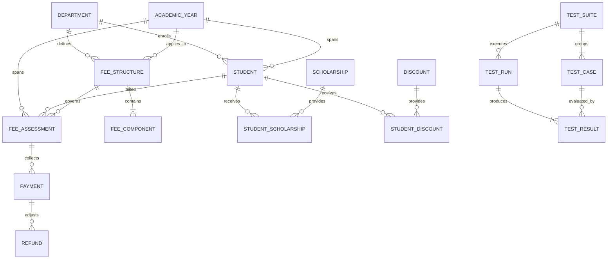

# 09 - Database Design

## 1. Design Principles
- **Relational Integrity**: Enforced via PostgreSQL primary keys, foreign keys with appropriate cascade rules, and check constraints.
- **Normalization**: Designed to 3rd Normal Form (3NF) to eliminate redundant storage of financial attributes while retaining point-in-time snapshots on transactional assessments.
- **Auditability**: Non-destructive updates on financial records; explicit payment states and refund tracking tables.
- **Performance**: Targeted composite indexes on frequent query paths (e.g., student search by roll number, payments by date, assessments by student and academic year).

## 2. Entity Relationship Overview
The database entities are logically divided into four operational clusters:

## 3. Entity Definitions

### Academic & Student Entities
- **Department**: Academic division (`id`, `code`, `name`, `status`).
- **AcademicYear**: Calendar academic session (`id`, `yearCode`, `startDate`, `endDate`, `isCurrent`).
- **Student**: Enrolled individual (`id`, `rollNumber`, `firstName`, `lastName`, `email`, `departmentId`, `academicYearId`, `status`).

### Fee Structure Entities
- **FeeStructure**: Base fee schedule (`id`, `name`, `departmentId`, `academicYearId`, `dueDate`).
- **FeeComponent**: Individual fee line item (`id`, `feeStructureId`, `componentType`, `name`, `amount`).
- **Scholarship**: Institutional waiver rule (`id`, `code`, `name`, `type`, `value`).
- **Discount**: Financial concession rule (`id`, `code`, `name`, `type`, `value`).
- **StudentScholarship / StudentDiscount**: Junction tables attaching waivers to students.

### Transactional & Financial Entities
- **FeeAssessment**: Student balance statement snapshot (`id`, `studentId`, `feeStructureId`, `baseAmount`, `scholarshipAmount`, `discountAmount`, `lateFineAmount`, `netPayable`, `paidAmount`, `outstandingAmount`, `status`).
- **Payment**: Recorded incoming funds (`id`, `feeAssessmentId`, `transactionRef`, `amount`, `paymentMethod`, `status`, `paymentDate`).
- **Refund**: Audit-safe outward adjustment (`id`, `paymentId`, `amount`, `reason`, `status`).

### Regression Testing Entities
- **TestSuite**: Logical grouping (`id`, `code`, `name`, `suiteType`).
- **TestCase**: Assertable test definition (`id`, `code`, `name`, `suiteId`, `inputPayload`, `expectedOutput`).
- **TestRun**: Execution run record (`id`, `suiteId`, `totalTests`, `passed`, `failed`, `durationMs`, `status`).
- **TestResult**: Granular test case outcome (`id`, `testRunId`, `testCaseId`, `expectedValue`, `actualValue`, `difference`, `status`).
- **DefectSimulation**: Flag toggle configuration for case study demonstration (`id`, `defectKey`, `isActive`).
- **AuditLog**: System-wide change journal (`id`, `entityType`, `entityId`, `action`, `oldState`, `newState`).
