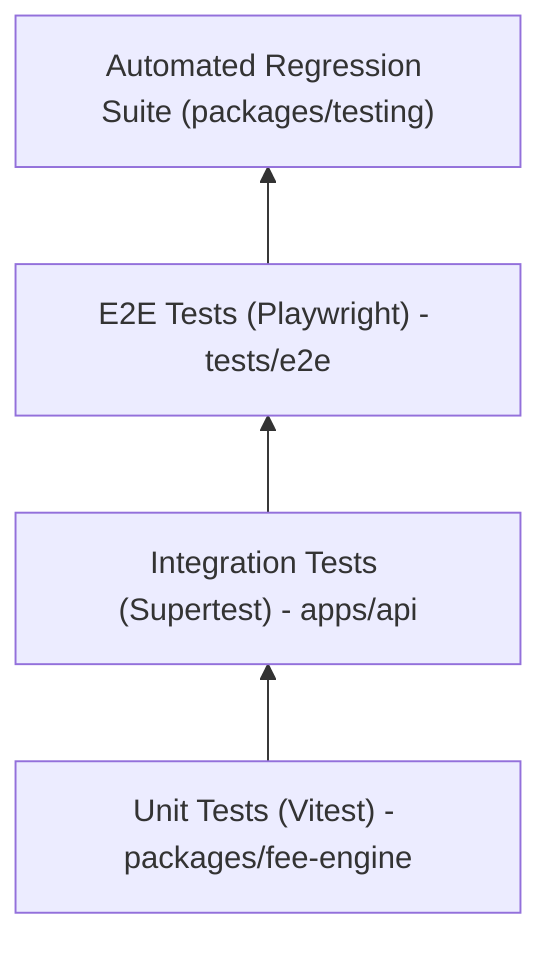

# 16 - Testing Strategy

## 1. Testing Pyramid
Quality assurance is structured into multiple decoupled tiers:

### 1.1 Unit Tests (`packages/fee-engine`)
- **Focus**: Pure function inputs, calculation math, decimal rounding, late fines, percentage vs. fixed reductions.
- **Speed**: Sub-second execution for hundreds of test vectors.
- **Tooling**: Vitest.

### 1.2 API / Integration Tests (`apps/api`, `tests/integration`)
- **Focus**: REST endpoints, Zod validation rejection, database transaction atomicity, Prisma queries, HTTP error formatting.
- **Tooling**: Vitest + Supertest + isolated test PostgreSQL container.

### 1.3 Automated Regression Testing (`packages/testing`)
- **Focus**: Continuous verification that modifications to business logic do not break existing report outputs or fee ledgers.
- **Mechanism**: Test cases with persistent JSON payloads and assertions executed across live endpoints and engines, with automatic diff generation.

### 1.4 End-to-End Tests (`tests/e2e`)
- **Focus**: Critical user journeys: enrolling a student, assigning fee structures, capturing payments, viewing reports, and monitoring regression test runs in the UI.
- **Tooling**: Playwright.
